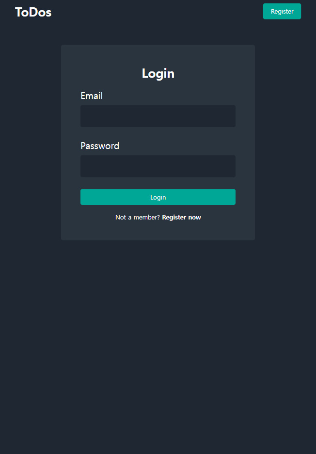
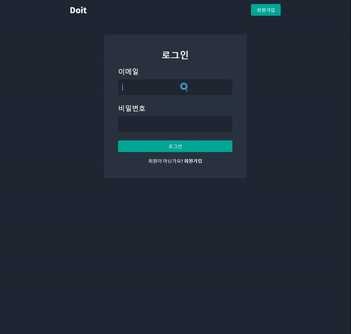
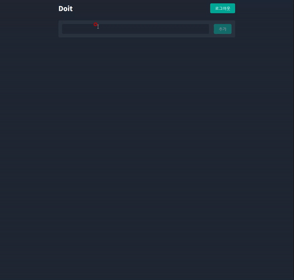
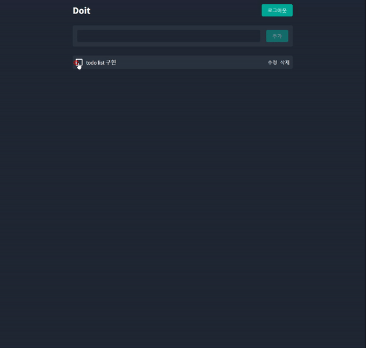
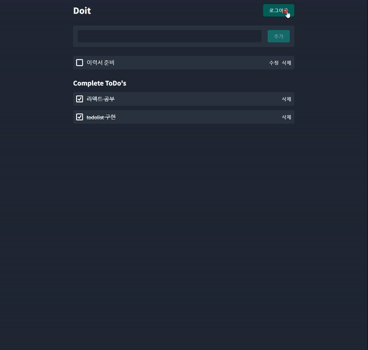
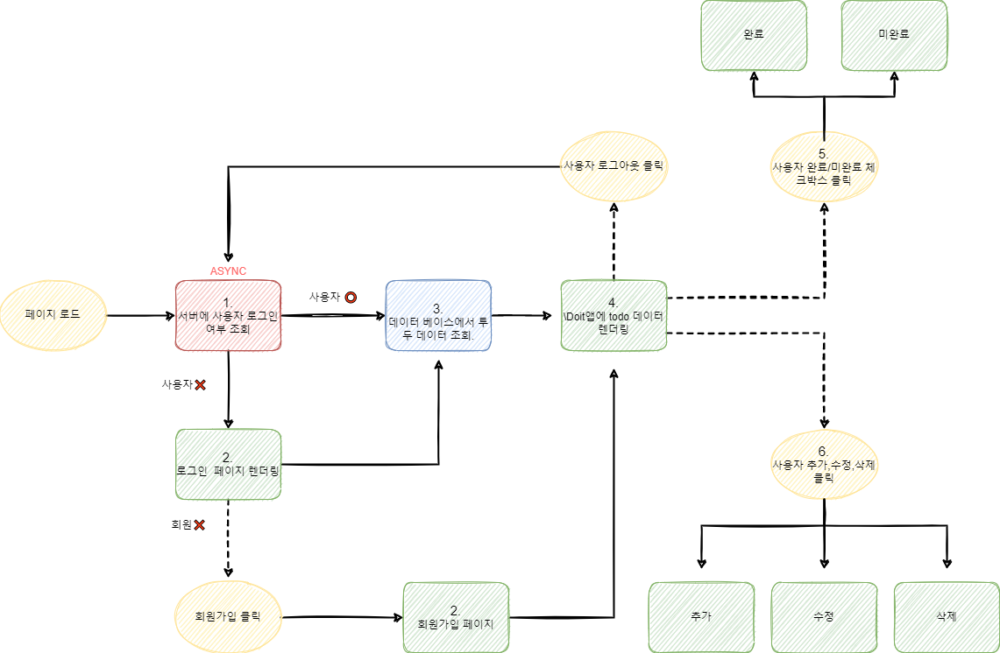
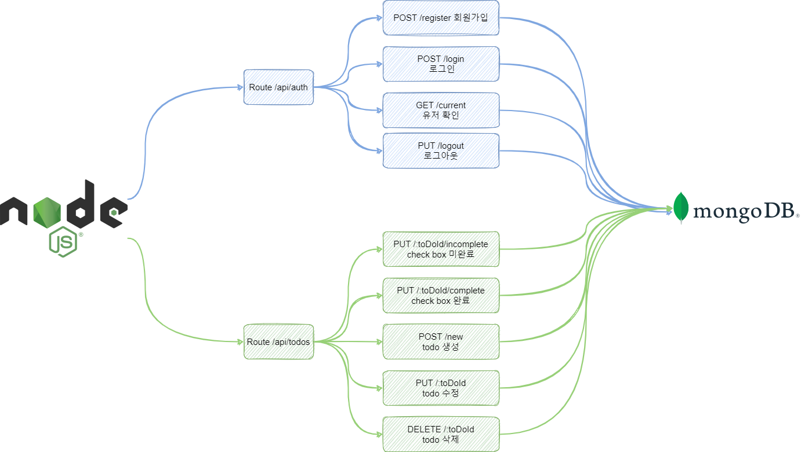

# 🏃‍♂️ [Doit](https://mern-doit.herokuapp.com/)

 

    
        
        
      
    
    
    

 
 

## 📝 서비스 소개

 
 

 

📃 시중에는 다양한 할 일 관리 앱들이 있지만, 그 중에도 많은 조작 없이 간단하게 할 일을 관리할 수 있고 아이디를 만들어 나만 볼수 있는 할 일 관리 앱의 필요성을 느껴 개발하였습니다.

 

✔ 배포 : https://mern-doit.herokuapp.com/
 

## 
📌 주요 기능

 

 
 

| [🔗 로그인 ](https://github.com/jackma914/js-run_record_app/wiki/%F0%9F%93%8C-%EC%A7%80%EB%8F%84-%ED%81%B4%EB%A6%AD) | [🔗 회원가입](https://github.com/jackma914/js-run_record_app/wiki/%F0%9F%93%8C-%EB%9F%B0%EB%8B%9D-%EC%82%AC%EC%9D%B4%ED%81%B4-%EC%B6%94%EA%B0%80) | [🔗 할일 CRUD](https://github.com/jackma914/js-run_record_app/wiki/%F0%9F%93%8C-%EB%A7%B5-%EC%9D%B4%EB%8F%99)
|:--:|:--:|:--:|
||||

 |[🔗 완료/미완료 ](https://github.com/jackma914/js-run_record_app/wiki/%F0%9F%93%8C-%EC%A7%80%EB%8F%84-%ED%81%B4%EB%A6%AD) | [🔗 로그아웃](https://github.com/jackma914/js-run_record_app/wiki/%F0%9F%93%8C-%EB%9F%B0%EB%8B%9D-%EC%82%AC%EC%9D%B4%ED%81%B4-%EC%B6%94%EA%B0%80)
|:--:|:--:|
|  || 

## 🛠 flowchart (흐름도)

 

### ✔ Doit 앱 흐름도 입니다.

 
 

1. Doit 앱을 시작하는 동시에 전역 context API에서 axios를 이용해 "/api/auth/current" 서버에 사용자 쿠키가 있는지를 조회합니다.
2. 쿠키 데이터가 없다면 로그인 페이지와 렌더링 됩니다. 로그인 페이지에서 아이디가 있다면 로그인을 없다면 회원가입을 합니다.
3. 유저가 로그인을 한다면 다시 context API에서 axios를 이용해 "/api/todos/current" 서버에 todo 데이터를 요청합니다.
4. 받아온 데이터는 reducer와 context API를 이용해 상태 관리를 합니다.   
5. 완료한 할 일의 체크박스를 클릭하면 서버에 axios를 이용해 `/api/todos/${toDo._id}/complete`서버에 보냅니다. 서버에서는 해당 _id와 같은 데이터를 데이터베이스에서 찾습니다. 찾은후 `complete: true` 값으로 변경해서 데이터를 반환합니다. 받은데이터는 context api와 reducer를 이용해 상태 관리를 합니다.
6. 할 일 생성은 입력한 값을 서버에 데이터를 `"api/todos/new"  { content }` 보내집니다. 서버에서는 유효성 검사를 한뒤 ToDo 스키마를 생성한뒤 데이터 베이스에 저장합니다. 저장한 값은 프론트로 return 합니다. return 받은 값은 다시 상태 관리를 이용해 incomplete에 생성됩니다.

 

 

### ✔ Doit 앱의 서버 흐름도 입니다.

 
 

## 🌟 트러블 슈팅

1. bind()

   - `_getPosition()` 메서드에서 `_loadMap()` 메서드로 위치 정보를 첫번째 인자로 보냅니다. 그냥 메서드를 호출해서 인자로 데이터를 보내면 오류가 발생합니다.
     이유는 여기서 `_loadMap()` 메서드는 getCurrentPosition의 콜백 함수인 일반함수로 호출 됩니다. 즉 `_loadMap()`의 this 키워드는 정의되지 않았습니다.
     해결 방법은 수동으로 메서드에 this를 바인딩 합니다. 이번 오류로 인해 binding을 이해했습니다.
     `this._loadMap.bind(this)`

      

2. 글로벌 함수,변수

   - 코드를 클래스화 시키면서 map 함수와 mapEvent 변수를 받아오면 에러가 발생합니다. 이를 해결하기위해 class App에 글로벌 함수와 변수로 선언해주었습니다.
     이번 오류로 인해 클래스를 장점인 가독성과 재사용성과 글로벌 변수에 대해 이해했습니다..
     `#map, #mapEvent`

      

3. 호이스팅

   - 함수는 정의하기전에 호출할 수 있지만 클래스는 반드시 정의한 뒤에 사용 가능합니다. 이유는 클래스가 호이스팅 될때 초기화는 되지 않기 때문입니다.

      

4. 에로우 함수

   - `validInput` 함수를 구현중 에로우 함수를 사용하였습니다. 중괄호를 생략하거나 return을 해야했는데 중괄호를 사용하고 유일한 문장이라 생각해 return을 해주지 않았습니다. 이로인해 계속해서 input form을 제출시 계속해서 정상 작동하지 않았습니다. 에러도 발생하지 않고 오작동만해서 이유를 찾는데 오랜 시간이 걸렸습니다. 중괄호를 지우고서 해결 되었습니다.

      

5. 재할당

   - if문 속에있는 변수를 사용해야 하는 상황에서 계속 에러가 발생했습니다.
     이유는 블록스코프 이기때문에 if문 밖에서 사용할수 없었습니다. 이를 해결 하기 위해 if문 밖에 let으로 선언한뒤 if문 솎의 변수를 재할당함으로써 블록 밖에서도 변수를 사용할수 있었습니다.

      

6. Private class fields
   - private 메서드와 private 변수를 이용해 코딩 습관을 만들고 에러를 방지하였습니다. 메서드는 밑중(\_)로 메서드를 감싸주었습니다. 변수는 앞에 #을 넣어 줌으로써 에러를 방지 하였습니다.

## 📌 버전
