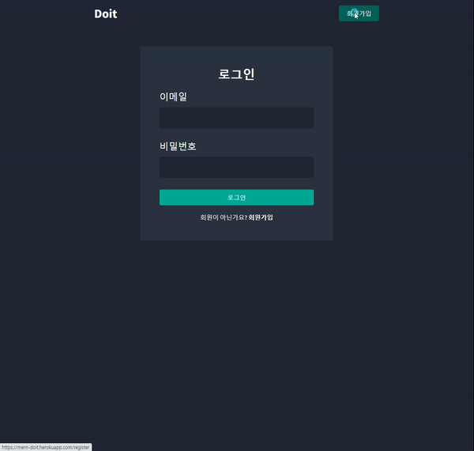

# 🏃‍♂️ [Doit](https://mern-doit.herokuapp.com/)

 

    
        
        
      
    
    
    

 
 

## 📝 서비스 소개

 
 

 

📃 시중에는 다양한 할 일 관리 앱들이 있지만, 그 중에도 많은 조작 없이 간단하게 할 일을 관리할 수 있고 아이디를 만들어 나만 볼수 있는 할 일 관리 앱의 필요성을 느껴 개발하였습니다.

 

✔ 배포 : https://mern-doit.herokuapp.com/
 

## 
📌 주요 기능

 

 
 

| [🔗 로그인 ](https://github.com/jackma914/js-run_record_app/wiki/%F0%9F%93%8C-%EC%A7%80%EB%8F%84-%ED%81%B4%EB%A6%AD) | [🔗 회원가입](https://github.com/jackma914/js-run_record_app/wiki/%F0%9F%93%8C-%EB%9F%B0%EB%8B%9D-%EC%82%AC%EC%9D%B4%ED%81%B4-%EC%B6%94%EA%B0%80) | [🔗 할일 CRUD](https://github.com/jackma914/js-run_record_app/wiki/%F0%9F%93%8C-%EB%A7%B5-%EC%9D%B4%EB%8F%99)
|:--:|:--:|:--:|
||||
 |[🔗 완료/미완료 ](https://github.com/jackma914/js-run_record_app/wiki/%F0%9F%93%8C-%EC%A7%80%EB%8F%84-%ED%81%B4%EB%A6%AD) | [🔗 로그아웃](https://github.com/jackma914/js-run_record_app/wiki/%F0%9F%93%8C-%EB%9F%B0%EB%8B%9D-%EC%82%AC%EC%9D%B4%ED%81%B4-%EC%B6%94%EA%B0%80)
|  || 

## 🛠 flowchart (흐름도)

 

### ✔ Doit 앱 흐름도 입니다.

 
 

1. Doit 앱을 접속하면 즉시 사용자의 토큰이 있는지 여부를 서버에서 조회합니다.
    - global context api 메서드에 `getCurrentUser()` 메서드를 useEffect를 이용해 실행합니다. `getCurrentUser()` 메서드에는 axios를 이용해 `/api/auth/current`유저 데이터를 받아와 권한이 있는지 없는지를 판단합니다.

 

2. 서버에서 토큰(권한)이 없다면 로그인 페이지로 렌더링됩니다. 회원이 아니라면 회원가입 페이지로 렌더링됩니다.
    - 로그인 페이지에서 form을 작성해 onSubmit 메서드를 실행하면 form 데이터를 담아서 axios를 이용해 `/api/auth/login` 서버로 보냅니다.
    - 넘어온 login 데이터를 데이터 베이스에 같은 이메일이 있는지를 확인합니다. 받아온 비밀번호는 bcrypt 라이브러리를 이용해 데이터 베이스의 비밀번호와 비교해 올바른 유저 데이터인지를 확인합니다. 그리고 토큰을 생성해 프론트로 데이터를 보냅니다.
    -  회원이 아니라면 resiger 버튼을 클릭하여 회원가입 페이지로 렌더링됩니다. 로그인과 같이 회원가입 form의 데이터를 `/api/auth/register` 서버로 보내집니다.
    -  넘어온 register 데이터를 `validateRegisterInput()` 유효성 확인 모듈에 데이터를 보내고 erros와 isValid 데이터를 받아옵니다.
기존 사용자가 있는지를 확인하고 비밀번호를 bcrypt를 이용해 암호화 합니다. 데이터를 새로운 User를 생성합니다. 새로운 User가 생성되고 토큰을 생성하고 쿠키에 저장합니다.

 

3. 1.번에서 사용자의 토큰이 있다면 axios를 이용해 `api/todos/current` 서버에 todo 데이터를 요청합니다.
    - 서버에서는 데이터베이스에 회원 정보를 조회한뒤 completeToDos, incompleteToDos todo 데이터를 받아옵니다.

 

4. 받아온 todo 데이터는 Doit 앱에 렌더됩니다.
    - 받아온 데이터는 context api와 reducer를 이용해 전역에서 데이터를 데이터 베이스에서 받아온 데이터를 사용할수 있게 전역에 provider를 이용해 설정해줍니다.

 

5. 렌더링된 Doit의 checkbox에는 완료와 미완료가 있습니다.
    - checkbox를 클릭하면 axois를 이용해 `/api/todos/${toDo._id}/complete` 서버에 해당 데이터의 _id를 보냅니다. 서버에서는 해당 complete를 true로 업데이트 합니다.
true가 된 해당 데이터는 context api의 `toDoComplete()`메서드에 데이터를 담아 보내집니다.
메서드에서는 dispatch를 이용해 상태 업데이트를 해줍니다.

 

6. 사용자 추가, 수정, 삭제를 구현합니다.
    - CRUD 기능도 axios를 이용해 서버로 데이터를 보낸뒤 해당 데이터를 데이터베이스에서 업데이트 한뒤 반환받습니다.
    - 받아온 데이터는 context api를 이용해 전역 상태 업데이트를 해줌으로써 CRUD를 구현합니다.
 

### ✔ Doit 앱의 서버 흐름도 입니다.

 
 

## 🌟 트러블 슈팅
1. 서버 express route
    - 서버의 코드가 너무 길어져서 가독성이 떨어졌습니다. 이를 해결하기 위해 express route를 공부하여 적용했습니다.

 

2. 정규 표현식
    - 회원가입이 완료된 이메일 스펠링의 대소문자를 바꾸서 가입 시도를 하면 가입이 되는걸 발견하였습니다.
    - 해결하기 위해 정규 표현식을 이용해 데이터 베이스에 유효성 검사를 할때 대소문자를 구별하지 않고 데이터 베이스에서 이메일 조회를 하도록 구현하였습니다.

 

3. props 변수 선언
    - props 변수 선언후 아무런 값이 안적혀 있는 props 사용방법을 보고 왜 값이 "true"인지를 이해못해서 구현하는데 어려웠습니다.
    - props 변수 선언후 값을 할당하지 않으면 기본값인 "true"를 할당합니다.

 

4. context api
    - context api와 redux 중에 어떤 라이브러리로 상태관리를 해야할지 고민했습니다.
    - 오직 전역 상태 관리를 위한다면 Context API를 사용하라는 글들이 많아서 context api를 이용해 상태관리를 구현했습니다.

 

5. map() 메서드 key 에러
    - map 메서드를 이용해 받아온 content 데이터를 화면에 출력 하려는중 consol에 key props를 설정해야 한다는 경고창이 보입니다.
    - 리액트에서 배열을 렌더링 할 때에는 key 라는 props 를 설정해야 합니다. key 값은 각 원소들마다 가지고 있는 고유값으로 설정 합니다. 지금의 경우엔 id를 값으로 넣었습니다.

 

6. Fragment
    - 컴포넌트를 구현중 `JSX expressions must have one parent element`오류가 발생했습니다.
    - 리엑트에서 컴포넌트가 반환하는 return 문 안에는 반드시 하나의 최상위 태그가 있어야 합니다.
    - 해결하기 위해 React Fragments `<> </>`를 이용해 해결하였습니다.

## 📌 버전
